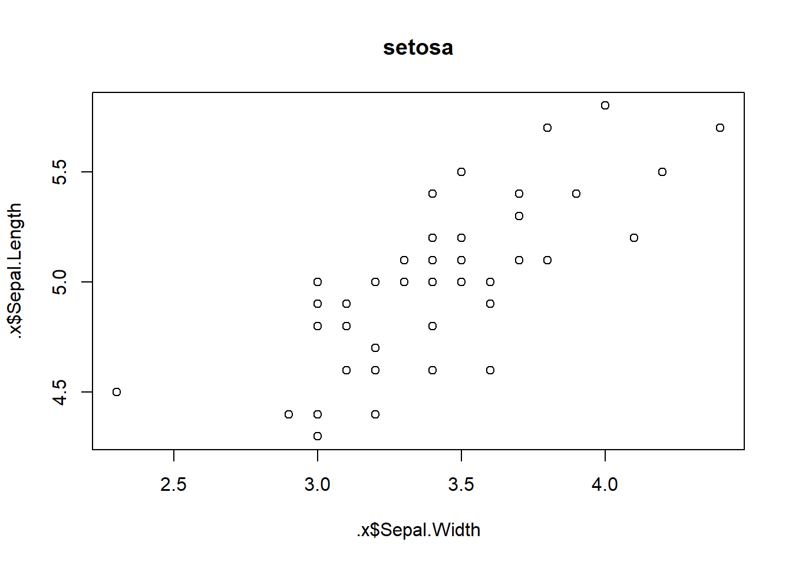
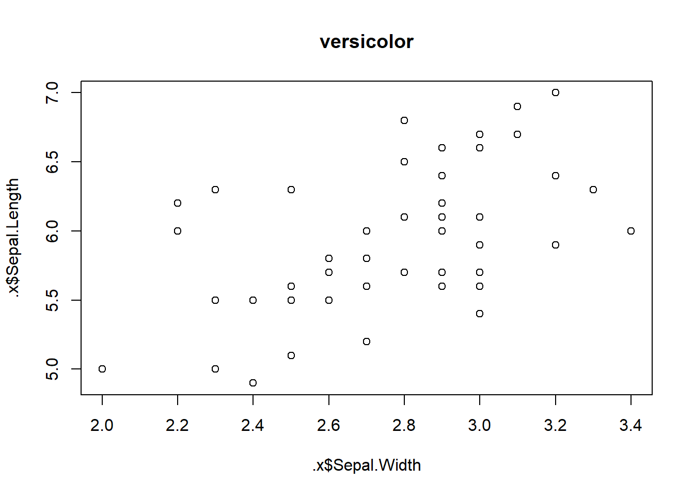

### Environments

[Environments](https://adv-r.hadley.nz/environments.html)

### Conditionals

[Conditionals](https://adv-r.hadley.nz/conditions.html)

### Functionals {#arfunctionals}

Functionals take a function as input and return a vector. The are commonly used 
in place of `for` loops.


```r
# apply a function to all even elements of a vector x
# use dots (...) to pass additional arguments to function
evens <- function(x, f, ...){
  f(x[x%%2==0], ...)
}

# passes na.rm=TRUE on to sum
evens(1:4, f = sum, na.rm=TRUE)
## [1] 6
evens(1:10, f = length)
## [1] 5
```

#### lapply() and purrr::map()

`lapply()` and `purrr::map()` are ubiquitous functionals. They take either an 
atomic or list vector and apply a function to each element and return a list:


```r
library(magrittr)
library(purrr)
## 
## Attaching package: 'purrr'
## The following object is masked from 'package:magrittr':
## 
##     set_names

f <- function(x) x*2

lapply(1:3, f) %>% str()
## List of 3
##  $ : num 2
##  $ : num 4
##  $ : num 6

map(1:3, f) %>% str()
## List of 3
##  $ : num 2
##  $ : num 4
##  $ : num 6
```

To predict what the apply family of functionals *can* do it's important to 
consider the input and output vectors.

* Atomic vs List Vector input

As `lapply()` or `map()` iterate through each vector element be aware of the object 
actually being passed. You might be iterating over each value in an atomic 
vector, or, with a list, potentially any R object (e.g. each atomic vector in a
dataframe). 


```r
1:10 %>% .[[1]]
## [1] 1

list(matrix(1:4, 2), TRUE, 1:10) %>% .[[1]]
##      [,1] [,2]
## [1,]    1    3
## [2,]    2    4
```

* Atomic vs List Vector output

`lapply()` and `map()` both return lists, which can contain any R object. So there 
is no limit to the objects returned by the function being applied.

However, other functionals in the `apply()` and `map()` family can return simplified 
objects like atomic vectors, in which case the applied function must return a single 
value of consistent type:


```r
# aggregate functions are okay because they return single values
vapply(mtcars[1:3], function(x) sum(x), FUN.VALUE = double(1))
##    mpg    cyl   disp 
##  642.9  198.0 7383.1

# this function errors because it would return an atomic vector, which cannot be an 
# element of an atomic vector
vapply(mtcars[1:3], function(x) x*2, FUN.VALUE = double(1))
## Error in vapply(mtcars[1:3], function(x) x * 2, FUN.VALUE = double(1)): values must be length 1,
##  but FUN(X[[1]]) result is length 32
```

##### Returning atomic vectors

To simplify the object type return from `map()`, `purrr` has the following `map_*()` 
functionals:


```r
# character
map_chr(letters[1:4], function(x) toupper(x))
## [1] "A" "B" "C" "D"

# logical
map_lgl(list(1:3, letters[1:3]), is.numeric)
## [1]  TRUE FALSE

# double
map_dbl(mtcars, function(x) if (max(x) <= 8) max(x) else NA)
##   mpg   cyl  disp    hp  drat    wt  qsec    vs    am  gear  carb 
##    NA 8.000    NA    NA 4.930 5.424    NA 1.000 1.000 5.000 8.000

# integer
map_int(list(1:3, T, letters[1:3]), length)
## [1] 3 1 3
```

Using `map()` may be helpful when debugging `map_*()`, as you could expect the 
list and see where invalid values were returned.

`vapply()` in base R is similar in that you can return an atomic vector of a 
specific type with argument `FUN.VALUE`:


```r
# FUN.VALUE must be a vector of the type you want returned, usually length 1 to 
# indicate that the return value should be the same length as x; see ?vapply
vapply(list(1:3, letters[1:3]), is.character, FUN.VALUE = logical(1))
## [1] FALSE  TRUE
```

Avoid `sapply()` as the simplified value may return different types.

##### Anonymous functions and purrr formulas

Anonymous functions can be used in the functional call, i.e. a function with no 
bound name.

`purrr` functions accepts a special, shorter syntax for creating anonymous functions. 
It converts formulas (`~`) to anonymous functions using `.x`/`..1`, `.y`/`..2`, 
`..3` etc arguments:


```r
map_dbl(1:3, ~ .x * .y, 10)
## [1] 10 20 30

# use as_mapper() to peer into the function created 
as_mapper(~ .x * .y)
## <lambda>
## function (..., .x = ..1, .y = ..2, . = ..1) 
## .x * .y
## attr(,"class")
## [1] "rlang_lambda_function" "function"
```

`purrr` also makes it easy to extract elements from lists by position, name, and/ 
name and position using the same functions, even when the lists are heavily 
nested:


```r
x <- list(
  list("1", a = 2.1, c = c(1.1,2.1)),
  list("2", a = 2.2, c = c(1.2,2.2))
)

map_chr(x, 1)
## [1] "1" "2"
map_dbl(x, "a")
## [1] 2.1 2.2
map_dbl(x, list("c",2))
## [1] 2.1 2.2
```

##### ... (dots) for passing arguments

In `lapply()` and `map()` additional arguments can be passed into function via 
`...`:


```r
# na.rm=TRUE is passed into function sum via dots
lapply(X = list(c(1,2,NA)), FUN = sum, na.rm=TRUE)
## [[1]]
## [1] 3
```

* decomposition

`...` are not decomposed; meaning, for example, if you were to pass a vector using 
`...` then the entire vector would be evaluated per function call, i.e. elements 
are not iterated in parallel with `X`:


```r
# for each element in 1:3, sum the vector passed in the second additonal argument .y
# if .y were decomposed, it would return 3, 2, 1
map_dbl(1:3, ~ sum(.y), 3:1)
## [1] 6 6 6
```
 
* `...` passed arguments vs intra-function arguments

Additional arguments are only evaluated once in a named function, but evaluated per 
function call in anonymous functions:


```r
# since .y is passed via ... it is only evaluated once
map_dbl(c(1,1,1), ~ .x * .y, .y=runif(1))
## [1] 0.3513488 0.3513488 0.3513488

# since .y is defined within the function, it is re-evaluated each time
map_dbl(c(1,1,1), ~ .x * runif(1))
## [1] 0.2566184 0.3698173 0.4780058
```

##### Apply as for loop generator

This is simply to document a creative use of `lapply` and `map` that might otherwise 
go unoticed.

1. generating random data

Map over a vector, not to transform the vector, but to thrice run a function 
generating data frames of random, normally distributed data sets. Mean and sd 
are defined within the function so it reevaluates each call:


```r
rnorm.data <- map(1:3,
    function(.x){
      mean = c(-100:100)[sample(length(-100:100), 
                                size = 1)]
      sd = c(0:20)[sample(length(0:10), 
                          size = 1)]
      
      data.frame(rnorm = rnorm(n=10, 
                               mean=mean, 
                               sd = sd),
               mean=mean,
               sd=sd)
    }
)

str(rnorm.data)
## List of 3
##  $ :'data.frame':	10 obs. of  3 variables:
##   ..$ rnorm: num [1:10] -43.8 -44.8 -45.2 -43.7 -47 ...
##   ..$ mean : int [1:10] -45 -45 -45 -45 -45 -45 -45 -45 -45 -45
##   ..$ sd   : int [1:10] 5 5 5 5 5 5 5 5 5 5
##  $ :'data.frame':	10 obs. of  3 variables:
##   ..$ rnorm: num [1:10] 6.1 5.48 6.42 4.91 7.77 ...
##   ..$ mean : int [1:10] 6 6 6 6 6 6 6 6 6 6
##   ..$ sd   : int [1:10] 1 1 1 1 1 1 1 1 1 1
##  $ :'data.frame':	10 obs. of  3 variables:
##   ..$ rnorm: num [1:10] -38.3 -38.2 -38.7 -36.9 -35.8 ...
##   ..$ mean : int [1:10] -38 -38 -38 -38 -38 -38 -38 -38 -38 -38
##   ..$ sd   : int [1:10] 1 1 1 1 1 1 1 1 1 1
```

2. Accessing related elements accross a data frame

You can apply a function using a `1:n` vector to subset dataframes by row index. 
In the example below using `mtcars`, this allows me to calculate the mean `mpg` 
only of cars which have a higher number of cylinders than the one being observed:


```r
vapply(1:nrow(mtcars), 
       function(i) mtcars[mtcars$cyl > mtcars[i,'cyl'],'mpg'] %>% 
       mean() %>% 
       round(1),
       FUN.VALUE = double(1)) %>%
  cbind(mtcars[,c('mpg','cyl')])
##                        .  mpg cyl
## Mazda RX4           15.1 21.0   6
## Mazda RX4 Wag       15.1 21.0   6
## Datsun 710          16.6 22.8   4
## Hornet 4 Drive      15.1 21.4   6
## Hornet Sportabout    NaN 18.7   8
## Valiant             15.1 18.1   6
## Duster 360           NaN 14.3   8
## Merc 240D           16.6 24.4   4
## Merc 230            16.6 22.8   4
## Merc 280            15.1 19.2   6
## Merc 280C           15.1 17.8   6
## Merc 450SE           NaN 16.4   8
## Merc 450SL           NaN 17.3   8
## Merc 450SLC          NaN 15.2   8
## Cadillac Fleetwood   NaN 10.4   8
## Lincoln Continental  NaN 10.4   8
## Chrysler Imperial    NaN 14.7   8
## Fiat 128            16.6 32.4   4
## Honda Civic         16.6 30.4   4
## Toyota Corolla      16.6 33.9   4
## Toyota Corona       16.6 21.5   4
## Dodge Challenger     NaN 15.5   8
## AMC Javelin          NaN 15.2   8
## Camaro Z28           NaN 13.3   8
## Pontiac Firebird     NaN 19.2   8
## Fiat X1-9           16.6 27.3   4
## Porsche 914-2       16.6 26.0   4
## Lotus Europa        16.6 30.4   4
## Ford Pantera L       NaN 15.8   8
## Ferrari Dino        15.1 19.7   6
## Maserati Bora        NaN 15.0   8
## Volvo 142E          16.6 21.4   4
```

#### Purrr style

Below is an example of using chained purrr functionals to solve a data analysis 
problem.

I want to extract $\beta_1$ coefficients from linear models of each sub-class 
Species in the Iris dataset. This example uses base R's `split()` to return a 
list of dataframes by group:


```r
split(iris, iris$Species) %>%
  map(~ lm(Sepal.Length ~ Sepal.Width, 
           data = .x)) %>% 
  map(~ coef(.x)) %>% 
  map_dbl('Sepal.Width')
##     setosa versicolor  virginica 
##  0.6904897  0.8650777  0.9015345
```

In Base R using functionals:


```r
temp_var <- split(iris, iris$Species)
temp_var <- lapply(temp_var, 
                   function(x) lm(Sepal.Length ~ Sepal.Width, 
                                            data = x))
vapply(temp_var, 
       function(x) coef(x)[['Sepal.Width']], 
       FUN.VALUE = double(1))
##     setosa versicolor  virginica 
##  0.6904897  0.8650777  0.9015345
```

#### Map variants

The `map()` family of functions has *orthagonal* inputs and outputs, meaning they 
can be summarised in a 2d matrix[input, output]:

(input) | List | Atomic Vector | Same type | Nothing
--- | --- | --- | --- | ---
One Argument | `map()` | `map_lgl(), ...` | `modify()` | `walk()`
Two Arguments | `map2()` | `map2_lgl(), ...` | `modify2()` | `walk2()`
One Argument + index | `imap()` | `imap_lgl(), ...` | `imodify()` | `iwalk()`
n Arguments | `pmap()` | `pmap_lgl(), ...` | | `pwalk()`

##### `modify()`

`modify()` always returns the same vector type as the input:


```r
# Logical input = logical output
modify(c(T,F,T), ~ is.numeric(.x))
## [1] FALSE FALSE FALSE

# Dataframe input = dataframe output
modify(data.frame(a=1:10, b=10:1), ~ .x *100)
##       a    b
## 1   100 1000
## 2   200  900
## 3   300  800
## 4   400  700
## 5   500  600
## 6   600  500
## 7   700  400
## 8   800  300
## 9   900  200
## 10 1000  100
```

##### `map2()`

`map2()` is vectorized over two arguments before the function:


```r
map2_chr(1:3, letters[1:3],
     ~ paste0(.x, .y))
## [1] "1a" "2b" "3c"
```

##### `walk()`

`walk()` returns a `NULL` list and is said to return "nothing". You would use this when 
you want to map a function over arguments for their side-effects, e.g. saving plots, 
writing data, printing messages:


```r
iwalk(c('Tom','Jerry'),
     ~ message('Hi-ya, ', .x ,'!'))
## Hi-ya, Tom!
## Hi-ya, Jerry!
```


##### `imap()`

`imap()` allows you to iterate on a vector and its index in parallel. It's similar 
to `map2(.x, .y = names(.x))` if `.x` is named, or `map2(.x, .y = seq_along(.x))` 
if not.

This is useful for labeling vectors already named, or working with vector elements 
and their index position (e.g. accessing further variables at the same index 
location).


```r
iwalk(split(iris, iris$Species)[1:2], ~ plot(.x$Sepal.Width, 
                                             .x$Sepal.Length, 
                                             main = paste0(.y)))
```



##### `pmap()`

`pmap()` generalizes the number of input vectors to decompose by passing a 
(possibly named) list for `.l`, commonly, a dataframe.


```r
pmap_dbl(.l = data.frame(a = 1:3, b=1:3, c=1:3), ~ .x + .y + ..3)
## [1] 3 6 9
```

In base R you can use `Map()` or `mapply()` for similar functionality. `Map()` is 
a wrapper for `mapply()` that will not try to simplify the return vector like 
`mapply()` will. `Map()` decomposes all input vectors.


```r
Map(function(...) ..1 + ..2 + ..3, 
    1:3, 
    1:3, 
    1:3) %>% str()
## List of 3
##  $ : int 3
##  $ : int 6
##  $ : int 9

mapply(function(...) ..1 + ..2 + ..3, 
       1:3, 
       1:3, 
       1:3)
## [1] 3 6 9
```

#### Reduce

The next important family of functionals is `reduce()` and is related to the 
map-reduce framework that powers many "big data" stacks.

**`reduce()` reduces a list to a single vector.**

##### Basics

In essence, `reduce()` (or `Reduce()` in base R) applys a *binary function* to 
two elements of a vector, and reduces the result to the first argument of the 
next function call plus the next element. For example, a four element vector:

`f( f( f(1,2), 3), 4)`

Or, to restate, **`reduce()` reduces a list to a single vector.**


```r
# Generate a 3 element list with 10 bootstrap samples from `1:20`
set.seed(11)
v <- map(1:3, ~ sample(x = 1:20, size = 10, replace = TRUE))
str(v)
## List of 3
##  $ : int [1:10] 2 16 17 5 12 7 3 11 7 13
##  $ : int [1:10] 2 17 8 15 7 6 14 3 3 11
##  $ : int [1:10] 18 12 2 3 10 16 11 2 9 8
```

In this example, we want to return a set containing numbers that appear in every 
element vector. `reduce()` applies `intersect( intersect(v[[1]], v[[2]]), v[[3]])` 
to find 2, 3, and 11 appear in each.


```r
reduce(v, intersect)
## [1]  2  3 11
```

Or, if we wanted to return the vector element with the greatest sum:


```r
reduce(v, function(x, y) if (sum(x) >= sum(y)) x else y )
##  [1]  2 16 17  5 12  7  3 11  7 13

# check this is correct by applying sum over each element
# reduce returned the first vector, which had the largest sum: 93
map_dbl(v, sum)
## [1] 93 86 91
```

##### Accumulate

`accumulate()` (or base R `Accumulate()`) is a `reduce()` variant that also returns 
all intermediate results, rather than just the final:


```r
# reduce only returns the final result
reduce(1:10, sum)
## [1] 55

# accumulate returns all call results; in this case the cummulative sum
accumulate(1:10, sum)
##  [1]  1  3  6 10 15 21 28 36 45 55

# our example from earlier intersecting each element of v show how the set 
# reduced with each call
accumulate(v, intersect) %>% str()
## List of 3
##  $ : int [1:10] 2 16 17 5 12 7 3 11 7 13
##  $ : int [1:5] 2 17 7 3 11
##  $ : int [1:3] 2 3 11
```

##### Output types

`reduce()` has an important argument `.init`. If supplied, `.init` is used to 
start the accumulation.

For example, what if you created a function using `reduce()`, except it's later 
passed a zero length vector?


```r
reduce(double(), sum)
## Error: `.x` is empty, and no `.init` supplied
```

You can supply an initial value instead:


```r
reduce(double(), sum, .init = 0)
## [1] 0
```


##### Multiple inputs

`reduce2()` exists, which takes two lists to decompose. The length of .y may vary 
if you supply `.init`.

This is a very rare scenario, but the functionality exists when you need it.

##### Map-Reduce

The concept of *map-reduce* is used to power "big data" applications like Hadoop. 
Put simply, vectors are mapped over multiple computers and then sent back to the 
*conductor*, which reduces the results into an output vector.

#### Predicates

**Predicates** are functions that return a single `TRUE`/`FALSE` like `is.null()` or 
`all()`. If the predicate returns `TRUE` you say the predicate **matches** the 
vector.

##### Predicate functionals

**Predicate functionals** apply a predicate to each element of a vector. Purrr
has the following variant pairs:

* `some()` if any element matches (base R `any()`)
* `every()` if all elements match (base R `all()`)


```r
df <- data.frame(a = 1:4,
                 b = letters[1:4],
                 c = 4:1,
                 d = letters[4:1],
                 stringsAsFactors = F)

some(df, .p =  is.numeric)
## [1] TRUE
every(df, .p =  is.numeric)
## [1] FALSE
```

* `detect()` return the value of the first match
* `detect_index` return the location of the first match


```r
detect(df, .f =  is.character)
## [1] "a" "b" "c" "d"
detect_index(df, .f = is.character)
## [1] 2
```

* `keep()` keep all matching elements
* `discard()` discard all matching elements


```r
keep(df, .p = is.numeric)
##   a c
## 1 1 4
## 2 2 3
## 3 3 2
## 4 4 1
discard(df, .p = is.numeric)
##   b d
## 1 a d
## 2 b c
## 3 c b
## 4 d a
```

##### Map variants

`map()` and `modify()` contain predicate variants that only apply over elements 
that match a predicate:


```r
df %>% str()
## 'data.frame':	4 obs. of  4 variables:
##  $ a: int  1 2 3 4
##  $ b: chr  "a" "b" "c" "d"
##  $ c: int  4 3 2 1
##  $ d: chr  "d" "c" "b" "a"

map_if(df, .p = is.numeric, ~ .x*2) %>% str()
## List of 4
##  $ a: num [1:4] 2 4 6 8
##  $ b: chr [1:4] "a" "b" "c" "d"
##  $ c: num [1:4] 8 6 4 2
##  $ d: chr [1:4] "d" "c" "b" "a"
modify_if(df, .p = is.character, ~ toupper(.x)) %>% str()
## 'data.frame':	4 obs. of  4 variables:
##  $ a: int  1 2 3 4
##  $ b: chr  "A" "B" "C" "D"
##  $ c: int  4 3 2 1
##  $ d: chr  "D" "C" "B" "A"

# wrap .x in a predicate functional to discard() or keep() columns by predicate
map_dbl(discard(df, is.character), ~ sum(.x))
##  a  c 
## 10 10
```

#### Base functionals

There are many more functionals in base R with mathmatrics/statistical 
applications, such as `integrate()` to find the area under the curve of a 
function, `uniroot()` to find where a function hits zero, and `optimise()` to 
return the highest and lowest values of a function.

Read more in [Base Functionals](https://adv-r.hadley.nz/functionals.html#base-functionals).
